# Functional-Based Reserving with the R Package ProfileLadder

The **R** package `ProfileLadder` provides nonparametric,
functional-based methods for claims reserving based on aggregated
chain-ladder data also known as the *run-off triangles*. The package
implements three estimation/prediction algorithms (PARALLAX, REACT, and
MACRAME) and the permutation bootstrap add-on proposed in Maciak,
Mizera, and Pešta (2022).

The package offers a flexible and computationally effective framework
for point-wise and distributional reserve predictions and includes
pertinent visualization and diagnostic tools through standard S3
methods—such as
[`plot()`](https://rdrr.io/r/graphics/plot.default.html),
[`predict()`](https://rdrr.io/r/stats/predict.html),
[`print()`](https://rdrr.io/r/base/print.html), or
[`summary()`](https://rdrr.io/r/base/summary.html). It also provides
accessor functions and real-world datasets to support exploratory
analysis across insurance, operational risks, and other domains where
triangular data structures arise, making modern, transparent, and
extensible alternatives to classical approaches accessible in insurance
industry and academic research.  

The following lines provide an illustrative sample analysis and reserve
prediction for two specific run-off triangles using all three
nonparametric prediction algorithms and other functions introduced
within the `ProfileLadder` package. The functionality of the core
functions of the package are and some important features are presented
and discussed. Further theoretical details can be found in

Maciak, M., Mizera, I., and Pešta, M. (2022). **Functional Profile
Techniques for Claims Reserving**. *ASTIN Bulletin*, 52(2), 449 – 482.
DOI:
[10.1017/asb.2022.4](https://www.cambridge.org/core/journals/astin-bulletin-journal-of-the-iaa/article/abs/functional-profile-techniques-for-claims-reserving/6A4C1D8FA8FC608CCF2C55BDE4C4522D)

------------------------------------------------------------------------

## Package manual and GitHub pages

- PDF/HTML manual: <https://CRAN.R-project.org/package=ProfileLadder>
- GitHub Pages: <https://42463863.github.io/ProfileLadder/index.html>

The package `ProfileLadder` can be installed directly from CRAN using a
standard command

``` r
install.packages("ProfileLadder")
```

The package `ProfileLadder` also allows for a convenient and elegant
integration with the leading actuarial **R** package `ChainLadder`
commonly utilized for risk assessment and actuarial practice. This is
mainly ensured through two functions implemented in `ProfileLadder`,
[`as.profileLadder()`](https://42463863.github.io/ProfileLadder/reference/as.profileLadder.md)
and
[`observed()`](https://42463863.github.io/ProfileLadder/reference/observed.md).
Therefore, both these actuarial libraries (**R** packages) are used in
the following illustrations.

``` r
library("ProfileLadder")
library("ChainLadder")
```

## Package structure

The key functions of the `ProfileLadder` package that implement three
functional-based nonparametric (point) reserve prediction algorithms and
the overall (distributional) reserve prediction in terms of the proposed
permutation bootstrap resampling are

- [`parallelReserve()`](https://42463863.github.io/ProfileLadder/reference/parallelReserve.md)
  – for PARALLAX and REACT;
- [`mcReserve()`](https://42463863.github.io/ProfileLadder/reference/mcReserve.md)
  – for the MACRAME algorithm;
- [`permuteReserve()`](https://42463863.github.io/ProfileLadder/reference/permuteReserve.md)
  – for the permutation bootstrap add-on.

Note some obvious (and practically convenient) similarities of the
notation and the implementation details that shared with the **R**
package `ChainLadder`. More details about the package structure—all
functions, S3 type methods, accessor functions, and illustrative
datasets can be found on [GitHub
Pages](https://42463863.github.io/ProfileLadder/reference/index.html).

## Notation and example datasets

There are two real datasets—cumulative run-off triangles (both from the
package `ProfileLadder`)—used in the following claims reserving example.

The *cummulative run-off triagle* is a specific data structure
represented by a collection of random variables denoted as
$\{ Y_{i,j};\ i = 1,\ldots,n;j = 1,\ldots,n - i + 1\}$, where the rows
$\{\left( Y_{i.1},\ldots,Y_{i,n - i + 1} \right)\}_{i = 1}^{n}$ are
typically assumed to be independent among each other and they represent
the origins of the reported claims. The columns, on the other hand,
represent the development periods.

The *incremental run-off triagle* is an analogous dataset represented by
a collection of random variables $X_{i,j}$’s,
$\{ X_{i,j};\ i = 1,\ldots,n;j = 1,\ldots,n - i + 1\}$, where
$X_{i,j} = Y_{i,j} - Y_{i,j - 1}$, for $i \in \{ 1,\ldots,n\}$ and
$j = 1,\ldots,n - i + 1$, where, in addition, $Y_{i,0} = 0$ for
completeness.

There are numerous (real-life) datasets (run-off triangles) not only
from the actuarial practice provided as an integral part of the
`ProfileLadder` package while most of them were not yet made available
in any other **R** package nor any other publicly available source. Some
of the datasets are unique in this aspect: For instance, the dataset
`GFCIB`, provided by the Guarantee Fund of the Czech Insurers’ Bureau
(GFCIB) and datasets `CZ.casco`, `CZ.liability`, and `CZ.property`
provided by a major and market-leading insurance company in the Czech
Republic contain relatively large (compared to other publicly available
actuarial data) run-off triangles (for example, `GFCIP` from the
mandatory car insurance in the Czech Republic contains $60$
origins/quarters and $60$ development periods—quarters again).
Similarly, the datasets `CZ.casco`, `CZ.liability`, and `CZ.property`
provide separate run-off triangles for gross paid amounts and RBNS
reserves (all with the dimensions $17 \times 17$ years).

A comprehensive overview of the data included in the `ProfileLadder`
package can be obtained in a standard way by using the command

``` r
data(package = "ProfileLadder")
```

Two particular run-off triangles are selected in the following
illustrations:

### a) Cameron Mutual Insurance Company Data

The dataset belongs to a larger database of real run-off triangles
(provided by Mayers and Shi, 2011) and available also (in a long format
structure) in the **R** package `raw`. The run-off triangle is completed
into a full square—meaning that “future” payments are known (typically
they are provided retrospectively, mainly for some evaluation and
back-testing purposes). \`

``` r
help("CameronMutual") ## output omitted
(cameron <- CameronMutual)
```

    ##       dev
    ## origin    1     2     3     4     5     6     7     8     9    10
    ##     1  5244  9228 10823 11352 11791 12082 12120 12199 12215 12215
    ##     2  5984  9939 11725 12346 12746 12909 13034 13109 13113 13115
    ##     3  7452 12421 14171 14752 15066 15354 15637 15720 15744 15786
    ##     4  7115 11117 12488 13274 13662 13859 13872 13935 13973 13972
    ##     5  5753  8969  9917 10697 11135 11282 11255 11331 11332 11354
    ##     6  3937  6524  7989  8543  8757  8901  9013  9012  9046  9164
    ##     7  5127  8212  8976  9325  9718  9795  9833  9885  9816  9815
    ##     8  5046  8006  8984  9633 10102 10166 10261 10252 10252 10252
    ##     9  5129  8202  9185  9681  9951 10033 10133 10182 10182 10183
    ##     10 3689  6043  6789  7089  7164  7197  7253  7267  7266  7266

### b) Vehicles Damages within a Conventional Full Casco Insurance

The second dataset represents a standard run-off triangle as it is
typically available for actuaries when performing the risk assessment
task and predicting the point and distributional reserve. The dataset
represents cumulative payments for claims related to the compulsory
vehicle insurance in the Czech Republic (having 17 origin years and,
similarly, 17 development perios—years again).

``` r
help("CZ.casco") ## output omitted
(casco <- CZ.casco$GrossPaid)
```

    ##       dev
    ## origin    Dev1    Dev2    Dev3    Dev4   Dev5   Dev6   Dev7   Dev8   Dev9
    ##     1   532522  689585  688841  689149 689357 689775 689742 689851 689851
    ##     2   423582  522523  522135  522605 522643 522352 522352 522329 522314
    ##     3   373866  486702  487670  486499 486370 486335 486352 486352 486260
    ##     4   441769  561423  558395  557759 557882 558181 558096 557934 557847
    ##     5   503292  632003  630153  630124 629686 629598 630431 630378 630357
    ##     6   554625  699257  700824  700508 700930 700889 701568 701462 701452
    ##     7   613011  759145  759427  759916 758478 758380 758204 758097 758324
    ##     8   605922  754837  758541  760264 760850 761308 761178 761153 761108
    ##     9   555154  659550  662410  663053 667075 667300 669785 669770 670158
    ##     10  514900  622015  623098  624337 624632 624664 624664 626112     NA
    ##     11  581196  706328  708099  708853 708447 708194 708428     NA     NA
    ##     12  613266  778185  780959  781436 781720 781561     NA     NA     NA
    ##     13  706120  885442  890414  891789 894514     NA     NA     NA     NA
    ##     14  859707 1052701 1057512 1059593     NA     NA     NA     NA     NA
    ##     15  951189 1197280 1207771      NA     NA     NA     NA     NA     NA
    ##     16 1061511 1317965      NA      NA     NA     NA     NA     NA     NA
    ##     17 1121591      NA      NA      NA     NA     NA     NA     NA     NA
    ##       dev
    ## origin  Dev10  Dev11  Dev12  Dev13  Dev14  Dev15  Dev16  Dev17
    ##     1  689839 689813 689795 689767 689664 689613 689568 689497
    ##     2  522271 522267 522231 522196 522104 522072 522003     NA
    ##     3  486090 485992 485988 485984 485984 485984     NA     NA
    ##     4  557781 557588 557198 557062 557049     NA     NA     NA
    ##     5  630338 630280 630270 630271     NA     NA     NA     NA
    ##     6  701439 701433 701433     NA     NA     NA     NA     NA
    ##     7  758263 758233     NA     NA     NA     NA     NA     NA
    ##     8  761068     NA     NA     NA     NA     NA     NA     NA
    ##     9      NA     NA     NA     NA     NA     NA     NA     NA
    ##     10     NA     NA     NA     NA     NA     NA     NA     NA
    ##     11     NA     NA     NA     NA     NA     NA     NA     NA
    ##     12     NA     NA     NA     NA     NA     NA     NA     NA
    ##     13     NA     NA     NA     NA     NA     NA     NA     NA
    ##     14     NA     NA     NA     NA     NA     NA     NA     NA
    ##     15     NA     NA     NA     NA     NA     NA     NA     NA
    ##     16     NA     NA     NA     NA     NA     NA     NA     NA
    ##     17     NA     NA     NA     NA     NA     NA     NA     NA

------------------------------------------------------------------------

## 1. Data visualization with `ProfileLadder`

Run-off triangles can be either printed in terms of a
complete/incomplete matrix (as above) or the data can be visualized
using a standard
[`plot()`](https://rdrr.io/r/graphics/plot.default.html) method;
however, two different S3 classes for the underlying run-off triangle
can be used—the run-off triangle is either of the class `triangle` (the
S3 class provided by the actuarial package `ChainLadder`) or an extented
triangle class `profileLadder`, implemented in the **R** package
`ProfileLadder`, can be used as a more complex alternative:

``` r
par(mfrow = c(1,2))

### S3 class 'triangle' from the ChainLadder pkg
plot(as.triangle(casco))

### S3 class 'profileLadder' from the ProfileLadder pkg
plot(as.profileLadder(casco))
```


The extended triangle class `ProfileLadder` (which can be converted from
the S3 classes `triangle` or `matrix` by using the
[`as.profileLadder()`](https://42463863.github.io/ProfileLadder/reference/as.profileLadder.md)
function) allows, in addtion, for plotting the future (“unknown”)
profiles—if they are provided in the data for some comparisons,
back-testing, or other evaluation purposes. This can be illustrated for
the Cameron Mutual insurance data (that contain such future profiles):

``` r
par(mfrow = c(1,3))
### S3 class 'triangle' from the ChainLadder pkg
plot(as.triangle(cameron))

### S3 class 'profileLadder' from the ProfileLadder pkg 
plot(as.profileLadder(observed(cameron)))

### S3 class 'profileLadder' (run-off triangle with future profiles)
plot(as.profileLadder(cameron))
```

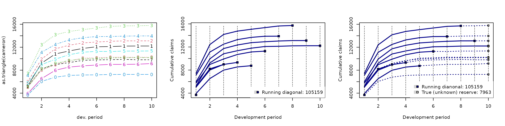

Once the future profiles are provided in the data, the information about
the true reserve, typically denoted as $R$ and defined as
$$R = \sum\limits_{i = 1}^{n}Y_{i,n} - \sum\limits_{i = 1}^{n}Y_{i,{(n - i + 1)}},$$
is also reflected in the legend as `True (unknown) reserve` (see the
right panel in the figure above). Otherwise, the task of an actuary is
to predict the reserve as
$$\widehat{R} = \sum\limits_{i = 2}^{n}{\widehat{Y}}_{i,n} - \sum\limits_{i = 2}^{n}Y_{i,{(n - i + 1)}},$$
where ${\widehat{Y}}_{i,n}$ for $i = 2,\ldots,n$ represents the
predicted *ultimate payments* (the last column of the completed run-off
triangle). The quantity $\sum_{i = 1}^{n}Y_{i,{(n - i + 1)}}$ represents
the amount of already paid claims (the sum of the last *running
diagonal*, values $Y_{i,n - i + 1}$, for $i = 1,\ldots,n$).

**Note:** The utility function
[`observed()`](https://42463863.github.io/ProfileLadder/reference/observed.md),
used in the code above and implemented in the **R** package
`ProfileLadder`, allows an easy integration of the package with the core
actuarial library `ChainLadder` and, particularly, the easily use the
data from other **R** package `raw` in both parametric and nonparametric
reserving techniques. More details can be found using the R help session
[`help("observed")`](https://42463863.github.io/ProfileLadder/reference/observed.md).

## 2. PARALLAX

The idea of the PARALLAX algorithm (**PARALL**el **A**ppro**X**imation
of missing fragments), is to impute the missing parts of the run-off
triangle by the most similar segments—triangle rows that can be found
among the already observed development profiles. The name reflects the
fact that the imputation of missing segments in unobserved functional
development profiles is always performed in a parallel way using the
observed fragments.

To illustrate the principle, we use the Cameron Mutual data first. The
run-off triangle provides also the “unknown” future outcomes (functional
profile segments that are supposed to be predicted by the algorithm).
However, typical information used in the actuarial practice (for claims
reserving and reserve prediction) would be of the run-off triangle form
as

``` r
observed(cameron)
```

    ##       dev
    ## origin    1     2     3     4     5     6     7     8     9    10
    ##     1  5244  9228 10823 11352 11791 12082 12120 12199 12215 12215
    ##     2  5984  9939 11725 12346 12746 12909 13034 13109 13113    NA
    ##     3  7452 12421 14171 14752 15066 15354 15637 15720    NA    NA
    ##     4  7115 11117 12488 13274 13662 13859 13872    NA    NA    NA
    ##     5  5753  8969  9917 10697 11135 11282    NA    NA    NA    NA
    ##     6  3937  6524  7989  8543  8757    NA    NA    NA    NA    NA
    ##     7  5127  8212  8976  9325    NA    NA    NA    NA    NA    NA
    ##     8  5046  8006  8984    NA    NA    NA    NA    NA    NA    NA
    ##     9  5129  8202    NA    NA    NA    NA    NA    NA    NA    NA
    ##     10 3689    NA    NA    NA    NA    NA    NA    NA    NA    NA

A fancy print option is also implemented in the `ProfileLadder` package
to visually distinguish between the data part that is typically
available at the time of the reserve prediction and the data that are
provided ex-post for some evaluation purposes. This can be set or
altered (in the interactive environments only) by

``` r
options(profileLadder.fancy = TRUE) 
set.fancy.print() ## custom-defined colors
```

The prediction of the future claims performed by the PARALLAX algorithm
is obtained as

``` r
(parallax.cameron <- parallelReserve(cameron))
```

    ## PARALLAX Reserving 
    ##     Estimated Reserve    Estimated Ultimate           Paid Amount 
    ##                  8540                113699                105159 
    ##          True Reserve 
    ##                  7963

    ## PARALLAX method (functional profile completion)

    ## 5244      9228   10823   11352   11791   12082   12120   12199   12215   12215   
    ## 5984      9939   11725   12346   12746   12909   13034   13109   13113   13113   
    ## 7452     12421   14171   14752   15066   15354   15637   15720   15724   15724   
    ## 7115     11117   12488   13274   13662   13859   13872   13947   13951   13951   
    ## 5753      8969    9917   10697   11135   11282   11320   11399   11415   11415   
    ## 3937      6524    7989    8543    8757    8904    8942    9021    9037    9037   
    ## 5127      8212    8976    9325    9539    9686    9724    9803    9819    9819   
    ## 5046      8006    8984    9333    9547    9694    9732    9811    9827    9827   
    ## 5129      8202    8966    9315    9529    9676    9714    9793    9809    9809   
    ## 3689      6276    7741    8295    8509    8656    8694    8773    8789    8789   

As far as the input data also contains “unknown” future developments,
the output above also provides the amount of the true reserve (`7963` –
which is not printed otherwise). Standard summary method can be applied
to the output of the
[`parallelReserve()`](https://42463863.github.io/ProfileLadder/reference/parallelReserve.md)
function – the S3 object of the class `ProfileLadder`:

``` r
summary(parallax.cameron)
```

    ## PARALLAX reserve prediction (by origins)
    ##       First Latest Dev.To.Date Ultimate IBNR
    ## 2      5984  13113   1.0000000    13113    0
    ## 3      7452  15720   0.9997456    15724    4
    ## 4      7115  13872   0.9943373    13951   79
    ## 5      5753  11282   0.9883487    11415  133
    ## 6      3937   8757   0.9690163     9037  280
    ## 7      5127   9325   0.9496894     9819  494
    ## 8      5046   8984   0.9142159     9827  843
    ## 9      5129   8202   0.8361709     9809 1607
    ## 10     3689   3689   0.4197292     8789 5100
    ## total 49232  92944   0.9158488   101484 8540

    ## Overall reserve summary

    ##     Est.Reserve    Est.Ultimate     Paid Amount    True Reserve        Reserve% 
    ##         8540.00       113699.00       105159.00         7963.00            7.25

The summary output above is analogous to the output provided by
parametric reserving methods implemented in `ChainLadder`. For example,
considering a typical benchmark over-dispersed Poisson model (ODP)
implemented in
[`glmReserve()`](http://mages.github.io/ChainLadder/reference/glmReserve.md)
from the R package `ChainLadder`, the following summary output is
provided:

``` r
summary(glmReserve(observed(cameron)))
```

    ##       Latest Dev.To.Date Ultimate IBNR          S.E        CV
    ## 2      13113   1.0000000    13113    0   0.01035287       Inf
    ## 3      15720   0.9992372    15732   12  29.38975320 2.4491461
    ## 4      13872   0.9934116    13964   92  73.46098788 0.7984890
    ## 5      11282   0.9850694    11453  171  96.26787355 0.5629700
    ## 6       8757   0.9688019     9039  282 120.58781735 0.4276164
    ## 7       9325   0.9397360     9923  598 177.57019068 0.2969401
    ## 8       8984   0.8905630    10088 1104 246.00693847 0.2228324
    ## 9       8202   0.7789914    10529 2327 379.54811405 0.1631062
    ## 10      3689   0.4788422     7704 4015 622.22022041 0.1549739
    ## total  92944   0.9152986   101545 8601 880.66723938 0.1023913

Due to obvious analogy between the outputs from the nonparametric
reserving method (‘parallelReserve()’) and the standard parametric
approach
([`glmReserve()`](http://mages.github.io/ChainLadder/reference/glmReserve.md))
we omit further interpretation of the whole output and we only focuss on
differences.

**Note:** The outout from the
[`summary()`](https://rdrr.io/r/base/summary.html) method applied to the
S3 class object `profileLadder` produced by the
[`parallelReserve()`](https://42463863.github.io/ProfileLadder/reference/parallelReserve.md)
function from the R package `ProfileLadder` shares the same layout as
the summary method applied to the classical parametric reserving methods
from the **R** package `ChainLadder` In the example above, the
[`summary()`](https://rdrr.io/r/base/summary.html) method is applied to
the object of the class `glmReserve` produced by
[`glmReserve()`](http://mages.github.io/ChainLadder/reference/glmReserve.md).

Note, that the `First` column is only given in the output for the
nonparametric reserving method (`ProfileLadder` package) while the
columns denoted as `S.E` and `CV` are only available for the parametric
approach (`ChainLadder` package). This is due to the fact that the ODP
model is based on a specific distributional assumption and, therefore,
standard errors (`S.E`) and the coefficient of variation (`CV`) can be
both directly obtained. The nonparametric PARALLAX algorithm is,
however, model-free and, therefore, the point prediction of the reserve
is provided only (unless a bootstrap resampling add-on is used – see
Section 5).

On the other hand, the summary for PARALLAX gives important information
about the origin stability – which is, in practice, very often accessed
from the first run-off triangle column.

Some additional information is also provided in the second part of the
output. In particular, beside the predicted reserve (`Est.Reserve`) and
the predicted ultimates (`Est.Ultimate`), there is also the sum of the
running diagonal provided (`Paid Amount`). In addition, if the run-off
triangle is accompanied with the true future outcomes, then the true
reserve and the prediction accuracy in terms of the ratio of the
predicted amount and the true value are both provided.

If the same reserving method is applied to the Casco insurance data
(i.e., incomple run-off triangle profiles) the summary output is very
similar but some values are missing in the outputs (`NA`s are provided
instead):

``` r
parallax.casco <- parallelReserve(casco)
summary(parallax.casco)
```

    ## PARALLAX reserve prediction (by origins)
    ##          First   Latest Dev.To.Date Ultimate   IBNR
    ## 2       423582   522003   1.0001360   521932    -71
    ## 3       373866   485984   1.0002882   485844   -140
    ## 4       441769   557049   1.0003089   556877   -172
    ## 5       503292   630271   1.0004286   630001   -270
    ## 6       554625   701433   1.0004250   701135   -298
    ## 7       613011   758233   1.0003932   757935   -298
    ## 8       605922   761068   1.0004312   760740   -328
    ## 9       555154   670158   1.0005285   669804   -354
    ## 10      514900   626112   1.0006025   625735   -377
    ## 11      581196   708428   1.0006116   707995   -433
    ## 12      613266   781561   1.0007273   780993   -568
    ## 13      706120   894514   1.0008134   893787   -727
    ## 14      859707  1059593   0.9981179  1061591   1998
    ## 15      951189  1207771   0.9966341  1211850   4079
    ## 16     1061511  1317965   0.9890660  1332535  14570
    ## 17     1121591  1121591   0.8053848  1392615 271024
    ## total 10480701 12803734   0.9780287 13091369 287635

    ## Overall reserve summary

    ##     Est.Reserve    Est.Ultimate     Paid Amount    True Reserve        Reserve% 
    ##          287635        13780866        13493231              NA              NA

Beside the reserve prediction $\widehat{R} = 287635$ (given in thousands
CZK) there is also an information about the estimated ultimate payments
(the sum of the last column in the completed run-off triangle), and the
summary of the claims being already paid— `Paid Amount` $13493231$
(again in thousands CZK). Note that last two values in the output are
denoted as `NA` because the future outcomes are not available for the
given run-off triangle. Both predictions can be directly visualized
using the S3 method
[`plot()`](https://rdrr.io/r/graphics/plot.default.html):

``` r
par(mfrow = c(1,2))
plot(parallax.cameron)
plot(parallax.casco)
```

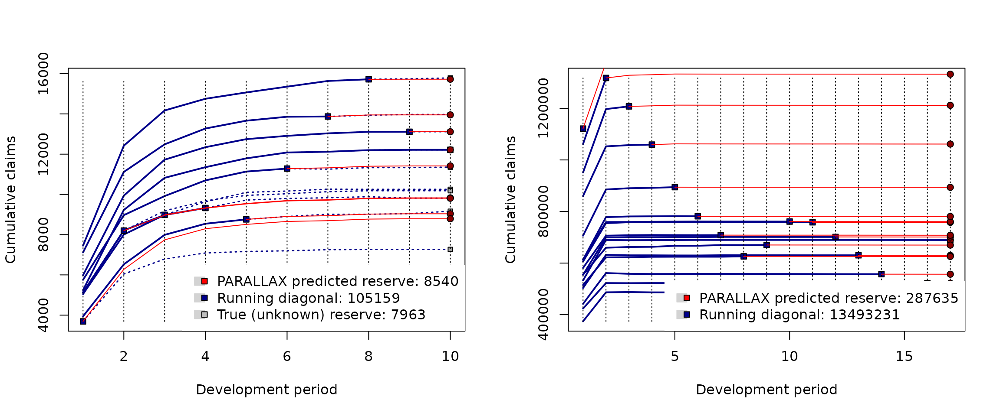

In general, the output of the
[`parallelReserve()`](https://42463863.github.io/ProfileLadder/reference/parallelReserve.md)
function is a list of the S3 method class `profileLadder` with the
following elements:

- `$reserve` – a numeric vector with four quantities: `Paid Amount`
  gives the overall claim payments being already settled by the
  insurance company – the sum of the last observed diagona,
  $\sum_{i = 1}^{n}Y_{i,n - i + 1}$; `Estimated Ultimate` states for the
  predicted total amount of claim payment – the sum of the last column
  in the completed run-off triangle,
  $\sum_{i = 1}^{n}{\widehat{Y}}_{i,n}$; `Estimated Reserve` gives the
  point prediction of the reserve $\widehat{R}$ – defined as the
  difference
  $\sum_{i = 1}^{n}{\widehat{Y}}_{i,n} - \sum_{i = 1}^{n}Y_{i,n - i + 1}$;
  Finally, `True Reserve` provides the true value of the reserve if such
  information is available;

- `$method` – type of the prediction algorithm being used to complete
  the run-off triangle and to give the point prediction of the reserve
  (`PARALLAX`, `REACT`, or `MACRAME`);

- `$Triangle` – the input run-off triangle;

- `$FullTriangle` – the completed run-off triangle – a full $n \times n$
  square;

- `$trueComplete` – the true run-off triangle – if available.

## 3. REACT

The REACT algorithm (approximation by the most **RE**cent
**AC**ciden**T** year) is implemented within the same **R** function as
the PARALLAX algorithm—the
[`parallelReserve()`](https://42463863.github.io/ProfileLadder/reference/parallelReserve.md)
function with an additional parameter `method = "react"` being
specified. In addition to the choice of the REACT algorithm, the
following **R** code also asks for the residuals, that should be
provided in the output. The same option (with the same functionality)
also applies for the PARALLAX algorithm (although it was not mentioned
in the section above).

``` r
react.cameron <- parallelReserve(cameron, method = "react", residuals = TRUE)
summary(react.cameron, plotOption = TRUE)
```

    ## REACT reserve prediction (by origins)
    ##       First Latest Dev.To.Date Ultimate IBNR
    ## 2      5984  13113   1.0000000    13113    0
    ## 3      7452  15720   0.9997456    15724    4
    ## 4      7115  13872   0.9937675    13959   87
    ## 5      5753  11282   0.9912142    11382  100
    ## 6      3937   8757   0.9725677     9004  247
    ## 7      5127   9325   0.9528919     9786  461
    ## 8      5046   8984   0.9172963     9794  810
    ## 9      5129   8202   0.8210210     9990 1788
    ## 10     3689   3689   0.4314620     8550 4861
    ## total 49232  92944   0.9174942   101302 8358

    ## Overall reserve summary

    ##     Est.Reserve    Est.Ultimate     Paid Amount    True Reserve        Reserve% 
    ##         8358.00       113517.00       105159.00         7963.00            4.96

    ## Residual summary (standard incremental residuals)

    ##      Min   1st Q.   Median     Mean   3rd Q.      Max  Std.Er. 
    ##     -719      -49       -1       -9       34      300      143 
    ## 
    ## Total number of residuals: 45,  Total number of unique residuals: 41
    ## Suspicious residuals (using 2σ rule): 2,  Outliers (3σ rule): 1

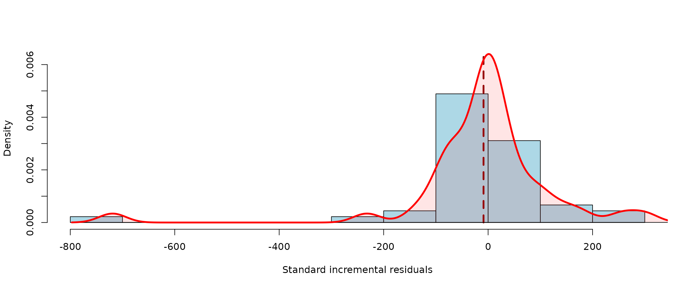

Unlike the output from the PARALLAX algorithm, there is an additional
information about the incremental residuals provided in the output from
REACT. Residuals are typically used by actuaries to evaluate the
performance of the prediction. The residuals are available from the
corresponding list item `$residulas` (which is provided in the
output—the object of the class `profileLadder`—if the residuals are
selected, i.e., `residuals = TRUE`). The residuals are defined as
differences between true incremental payments $X_{i,j}$ and the
predicted ones \_{i,j}\$ and they can be also printed within the
triangle as

``` r
react.cameron$residuals
```

    ##       dev
    ## origin  1    2    3   4    5    6   7   8   9  10
    ##     1  NA   NA   NA  NA   NA   NA  NA  NA  NA  NA
    ##     2  NA   NA   NA  NA   NA   NA  NA  NA  NA   2
    ##     3  NA   NA   NA  NA   NA   NA  NA  NA  20  42
    ##     4  NA   NA   NA  NA   NA   NA  NA -20  34  -1
    ##     5  NA   NA   NA  NA   NA   NA -40  -7  -3  22
    ##     6  NA   NA   NA  NA   NA   -3  99 -84  30 118
    ##     7  NA   NA   NA  NA  179  -70  25 -31 -73  -1
    ##     8  NA   NA   NA 300  255  -83  82 -92  -4   0
    ##     9  NA   NA    5 147   56  -65  87 -34  -4   1
    ##     10 NA -719 -232 -49 -139 -114  43 -69  -5   0

If there are no residuals provided in the output (i.e.,
`residuals = FALSE`) and the graphical option is set to
`plotOption = TRUE`, then slightly different figure (with the prediction
summary in terms of a barplot) is provided:

``` r
summary(parallelReserve(cameron, method = "react"), plotOption = TRUE)
```

    ## REACT reserve prediction (by origins)
    ##       First Latest Dev.To.Date Ultimate IBNR
    ## 2      5984  13113   1.0000000    13113    0
    ## 3      7452  15720   0.9997456    15724    4
    ## 4      7115  13872   0.9937675    13959   87
    ## 5      5753  11282   0.9912142    11382  100
    ## 6      3937   8757   0.9725677     9004  247
    ## 7      5127   9325   0.9528919     9786  461
    ## 8      5046   8984   0.9172963     9794  810
    ## 9      5129   8202   0.8210210     9990 1788
    ## 10     3689   3689   0.4314620     8550 4861
    ## total 49232  92944   0.9174942   101302 8358

    ## Overall reserve summary

    ##     Est.Reserve    Est.Ultimate     Paid Amount    True Reserve        Reserve% 
    ##         8358.00       113517.00       105159.00         7963.00            4.96

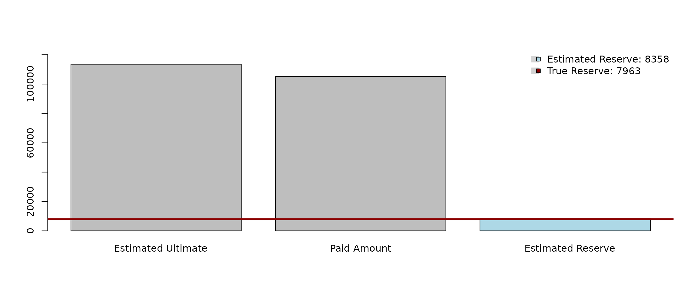

  

**Note:** There are two sets of residuals typically used by actuaries
and both of them can be provided in the output of the
[`parallelReserve()`](https://42463863.github.io/ProfileLadder/reference/parallelReserve.md)
function. Either standard residuals in terms of
$X_{i,j} - {\widehat{X}}_{i,j}$ are provided if the “future” (unknown)
increments are available (for instance, for some retrospective
back-testing or validation purposes) or, alternatively, so-called
“back-fitted” residuals are calculated instead.

The main idea behind the back-fitted residuals is to flip the completed
triangle, transform it back to the run-off triangle by deleting the
lower triangularpart, and to use such run-off triangle as an~input to
back-predict the run-off triangle by applying the same estimation
procedure in_(a)reverse manner so to say. Formally, the flipped matrix
is a transposition with respect to the second diagonal—mathematically
expressed, for a completed square
$\{{\widehat{Y}}_{i,j};\ i = 1,\ldots,n;j = 1,\ldots,n\}$, the “flipped
triangle” is the square
$\{{\widetilde{Y}}_{i,j};\ i = 1,\ldots,n;j = 1,\ldots,n\}$, where
${\widetilde{Y}}_{i,j} = {\widehat{Y}}_{n + 1 - i,n + 1 - j}$.

For illustration, and differences between the standard incremental
residuals and the back-fitted residuals (that are more common in claims
reserving practice), compare the following two outputs:

``` r
### standard residuals for a fully observed square
parallelReserve(cameron, method = "react", residuals = TRUE)$residuals  

### backfitted residuals for the observed run-off triangle only
parallelReserve(observed(cameron), method = "react", residuals = TRUE)$residuals
```

## 4. MACRAME

The idea of the MACRAME algorithm (**MA**rkov **C**hain f**RA**g**ME**nt
approximation) is to utilize a homogeneous Markov chain (MC) model to
obtain the reserve prediction. This strategy is slightly different and
more complex than the previous two; despite its additional mathematical
complexity, however, it is quite intuitive and can be seen as a complex
but rigorous generalization of the previous two algorithms described
above. The underlying stochastic model invites additional user-defined
adjustments and practically oriented modifications.

Unlike the previous two algorithms, MACRAME is based on the incremental
run-off triangle. In the first step, the algorithm transforms the
incremental payments
$\{ X_{i,j};i = 1,\ldots,n;j = 1,\ldots,n + 1 - i\}$ into a finite set
of states of a homogeneous Markov chain, $S = \{ s_{1},\ldots,s_{m}\}$,
and the observed run-off triangle is used to estimate the matrix of the
corresponding transition probabilities
${\mathbb{P}} = (p\left( s_{\iota_{1}},s_{\iota_{2}} \right))_{\iota_{1} = 1,\iota_{2} = 1}^{{|S|},{|S|}}$,
for
$$p\left( s_{\iota_{1}},s_{\iota_{2}} \right) = \mathsf{P}\left\lbrack U_{i,j + 1} = s_{\iota_{2}}|U_{i,j} = s_{\iota_{1}} \right\rbrack$$
where the increment $X_{i,j}$ is represented by the Markov state from
$S$ that is taken by $U_{i,j}$. Thus, there are three pivots behind the
MACRAME algorithm:

- **Break points** – the set of points
  $- \infty = g_{0} < g_{1} < \ldots < g_{m - 1} < g_{m} = \infty$;
- **Markov states** – the set of points $S = \{ s_{1},\ldots,s_{m}\}$,
  where, typically, $m = n$;
- **Transition matrix** – the matrix
  ${\mathbb{P}} = (p\left( s_{\iota_{1}},s_{\iota_{2}} \right))_{\iota_{1} = 1,\iota_{2} = 1}^{{|S|},{|S|}}$
  with the corresponding estimates for the probabilities of transitions
  between the states.

The MACRAME algorithm is implemented in the **R** function
[`mcReserve()`](https://42463863.github.io/ProfileLadder/reference/mcReserve.md)
(from the `ProfileLadder` package) using a similar scope as the
`parallelResrve()` function discussed above. The run-off triangle
completion and the reserve prediction obtained by the DEFAULT
(data-driven) verion of the MACRAME algorithm can be obtained by running

``` r
(macrame.cameron <- mcReserve(cameron))
```

    ## MACRAME Reserving 
    ##     Estimated Reserve    Estimated Ultimate           Paid Amount 
    ##              8081.963            113240.963            105159.000 
    ##          True Reserve 
    ##              7963.000

    ## MACRAME method (functional profile completion)

    ## 5244      9228   10823   11352   11791   12082   12120   12199   12215   12215   
    ## 5984      9939   11725   12346   12746   12909   13034   13109   13113   13160   
    ## 7452     12421   14171   14752   15066   15354   15637   15720   15756   15799   
    ## 7115     11117   12488   13274   13662   13859   13872   13919   13960   14003   
    ## 5753      8969    9917   10697   11135   11282   11340   11380   11422   11464   
    ## 3937      6524    7989    8543    8757    8815    8855    8897    8939    8982   
    ## 5127      8212    8976    9325    9496    9588    9646    9693    9737    9780   
    ## 5046      8006    8984    9677   10157   10458   10641   10759   10840   10902   
    ## 5129      8202    9244    9808   10165   10376   10502   10586   10649   10701   
    ## 3689      4731    5295    5652    5863    5989    6073    6136    6188    6236   

The output of the MACRAME algorithm is again the S3 class object
`profileLadder` and, thus, the same S3 methods as before can be applied
again (in particuler, the following S3 methods are available:
[`print()`](https://rdrr.io/r/base/print.html),
[`plot()`](https://rdrr.io/r/graphics/plot.default.html), and
[`summary()`](https://rdrr.io/r/base/summary.html)). The performance of
all three nonparametric prediction algorithms (PARALLAX, REACT, and
MACRAME) can be quantitatively and visually compared (using the Cameron
Mutual dataset).

``` r
par(mfrow = c(1,3))

### PARALLAX reserve prediction and run-off completion
plot(parallelReserve(cameron))

### REACT reserve prediction and run-off completion
plot(parallelReserve(cameron, method = "react"))

### MACRAME reserve prediction and run-off completion
plot(mcReserve(cameron))
```

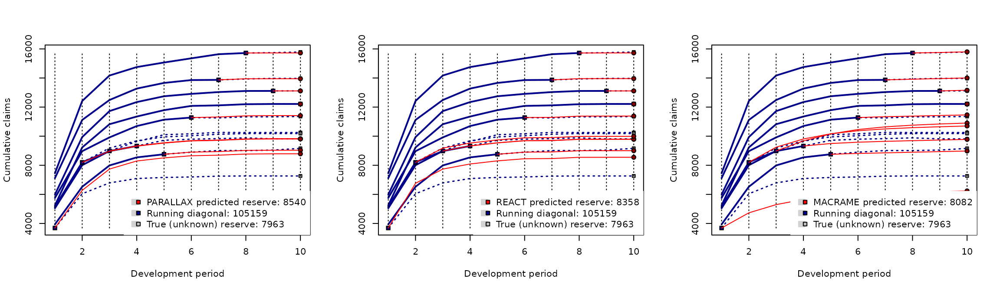

The red curve segments represent the predicted profile completions. The
blue solid lines represent the available data—the underlyhing run-off
triangle and the blue dotted lines stands for the “unknown” true
developments (if available in the input data).

Recall, that the true reserve is $R = 7963$. The reserve predictions
provided by the proposed nonparametric reserving methods are

- PARALLAX: $\widehat{R} = 8540$
- REACT: $\widehat{R} = 8358$
- MACRAME: $\widehat{R} = 8082$

This can be directly compared with the performance of some common
parametric reserving methods implemented in the `ChainLadder` package:

- chainladder method (implemented in
  [`chainladder()`](http://mages.github.io/ChainLadder/reference/chainladder.md)):
  $\widehat{R} = 8687$
- over-dispersed Poisson model
  ([`glmReserve()`](http://mages.github.io/ChainLadder/reference/glmReserve.md)):
  $\widehat{R} = 8601$
- Tweedie model
  ([`tweedieReserve()`](http://mages.github.io/ChainLadder/reference/tweedieReserve.md)):
  $\widehat{R} = 8610$

The best reserve prediction (in terms of the smallest difference between
the true reserve) is given by the MACRAME algorithm. More complex
empirical comparisons can be found in Maciak, Mizera, and Pešta (2022).

The underlying stochastic model behind the MACRAME algorithm invites
additional user-defined adjustments and practically oriented
modifications; unlike the MACRAME algorithm described in Maciak, Mizera,
and Pešta (2022), where only a constrained and rather limited version of
the algorithm was proposed, the implementation in the **R** function
[`mcReserve()`](https://42463863.github.io/ProfileLadder/reference/mcReserve.md)
in the `ProfileLadder` package allows for all kinds of fine tuning and
user-based modifications. Specific details can be either found in
Maciak, Matúš, Mizera, and Pešta (2026) or in the package documentation
([GitHub](https://42463863.github.io/ProfileLadder/) or
[CRAN](https://CRAN.R-project.org/package=ProfileLadder)).

Maciak, M., Mizera, I., and Pešta, M. (2022). **Functional Profile
Techniques for Claims Reserving**. *ASTIN Bulletin*, 52(2), 449 – 482.
DOI:
[10.1017/asb.2022.4](https://www.cambridge.org/core/journals/astin-bulletin-journal-of-the-iaa/article/abs/functional-profile-techniques-for-claims-reserving/6A4C1D8FA8FC608CCF2C55BDE4C4522D)

Maciak, M., Matúš, R., Mizera, I., and Pešta, M. (2026).
**ProfileLadder: Functional-Based Reserving**. *The R journal*, *(to
appear)*. URL: <https://journal.r-project.org/issues.html>

### User-based modifications of MACRAME

The implementation of the algorithm in the R function
[`mcReserve()`](https://42463863.github.io/ProfileLadder/reference/mcReserve.md)
allows users to intervene with various modifications—starting with a
pre-specified  
number of the Markov states to be required, selecting the method how the
run-off triangle increments are summarized into the states, or providing
a fully manual specification of the states
$S = \{ s_{1},\ldots,s_{m}\}$, breaks $\{ g_{k}\}_{k = 0}^{m}$, or the
subset of increments to be used.

Details (that are omitted here) can be found in the R help session for
the
[`mcReserve()`](https://42463863.github.io/ProfileLadder/reference/mcReserve.md)
function by typing

``` r
help("mcReserve")
```

In order to get some useful insight about the structure of the
incremental run-off triangle and to offer some visual inspection for
various user-based modifications of the underlying Markov chain in the
[`mcReserve()`](https://42463863.github.io/ProfileLadder/reference/mcReserve.md)
function, there is another practical tool implemented in the
`ProfileLadder` package—function
[`incrExplor()`](https://42463863.github.io/ProfileLadder/reference/incrExplor.md).

The function takes the run-off triangle as an input (fully observed or
not, incremental or cumulative) and returns a complex empirical
exploration of the incremental payments (that are used by `macrame()` to
set the Markov chain within the MACRAME algorithm).

The default performance of the
[`incrExplor()`](https://42463863.github.io/ProfileLadder/reference/incrExplor.md)
function returns a fully data-driven setup of the underlying Markov
chain—the set of the data-driven Markov states and the corresponding set
of break points:

``` r
(exploratory.casco <- incrExplor(casco))
```

    ## Data-driven (default) setting of the Markov Chain in MACRAME

    ## MC States: -957.5 -272 -129.5 -90 -55.5 -35.5 -25.5 -13 -4 0 230.5 420 716.5 1645 3863 116245 172120.5
    ## 
    ## Corresponding bins for the run-off triangle increments
    ##  [1] "[-Inf, -390)"    "[-390, -162)"    "[-162, -98)"     "[-98, -69)"     
    ##  [5] "[-69, -43)"      "[-43, -30)"      "[-30, -18)"      "[-18, -6)"      
    ##  [9] "[-6, 0)"         "[0, 123)"        "[123, 299)"      "[299, 489)"     
    ## [13] "[489, 1239)"     "[1239, 2725)"    "[2725, 98941)"   "[98941, 146134)"
    ## [17] "[146134, Inf)"

The output from the
[`incrExplor()`](https://42463863.github.io/ProfileLadder/reference/incrExplor.md)
function is an object of the S3 class `mcSetup` and the S3 methods
[`summary()`](https://rdrr.io/r/base/summary.html) and
[`plot()`](https://rdrr.io/r/graphics/plot.default.html) can be applied
to get further details.

``` r
summary(exploratory.casco)
```

    ## Input triangle type: Cumulative

    ## Summary of the increments
    ##                        Min   1st Q. Median       Mean   3rd Q.    Max
    ## Raw increments  -3028.0000 -62.0000     -2 18235.0000 867.0000 256454
    ## Std. increments    -0.0118  -0.0002      0     0.0711   0.0034      1
    ##                    Std.Er.
    ## Raw increments  51534.0000
    ## Std. increments     0.2009
    ## 
    ## Total number of increments: 136,  Total number of unique increments: 121
    ## Number of suspicious increments (using 2σ rule): 15,  Outliers (3σ rule): 6
    ## 
    ## Data-driven bins for the run-off triangle increments
    ##  [1] "[-Inf, -390)"    "[-390, -162)"    "[-162, -98)"     "[-98, -69)"     
    ##  [5] "[-69, -43)"      "[-43, -30)"      "[-30, -18)"      "[-18, -6)"      
    ##  [9] "[-6, 0)"         "[0, 123)"        "[123, 299)"      "[299, 489)"     
    ## [13] "[489, 1239)"     "[1239, 2725)"    "[2725, 98941)"   "[98941, 146134)"
    ## [17] "[146134, Inf)"  
    ## 
    ## Markov Chain states (medians of the increments within each bin)
    ##  [1]   -957.5   -272.0   -129.5    -90.0    -55.5    -35.5    -25.5    -13.0
    ##  [9]     -4.0      0.0    230.5    420.0    716.5   1645.0   3863.0 116245.0
    ## [17] 172120.5

``` r
plot(exploratory.casco)
```

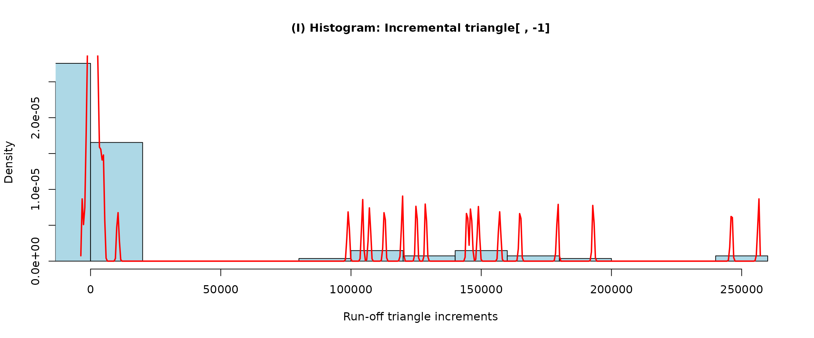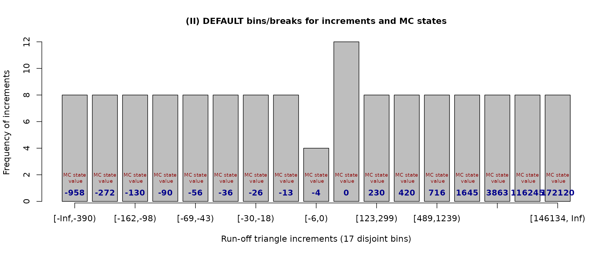

Using the barplot figure above, the break-points
$\{ g_{m}\}_{m = 0}^{n}$ are listed as interval labels on the $x$ axis.
The Markov states (taken by default as medians of the increments
belonging to a specific interval defined by two consecutive break
points) are given as the blue labes within the bars.

The data-driven method for defining the break points and the
corresponding Markov states (that are provided in the outputs above) is
described and theoretically justified in Maciak, Mizera, and Pešta
(2022). Further details are omiited here.

Possible user-based modifications are described in the following
sections.

#### a) Modifying the underlying Markov states

It can be noticed from the barplot above that there are relatively many
small (negative) Markov states (-957.5, -272.0, -129.5, etc.) that are
due to many rather small negative increments while there are much more
important (from the reserve prediction point of view) and much larger
positive claim payments that are reflected in a roughly same amount of
positive Markov states.

Thus, it could be interesting to modify the underlying Markov chain in a
way that all negative increments are rather ignored—for instance, by
introducing just one state for all zero and negative payments—and to
focuss more on crutial claim payments that may heavily effect the final
reserve. This can be done by the additional parameter `states = ...`
which is implemented in both functions—the exploratory function
[`incrExplor()`](https://42463863.github.io/ProfileLadder/reference/incrExplor.md)
and the prediction algorithm
[`mcReserve()`](https://42463863.github.io/ProfileLadder/reference/mcReserve.md).

In the following outputs, there are eight explicit Markov states used
(`c(0, 230, 420, 716, 1645, 3863, 116245, 172120)`) and the
corrresponding break points $g_{1} < ... < g_{7}$ are determined as
middle points between two consecutive Markov states (with
$g_{0} = - \infty$ and $g_{9} = \infty$):

``` r
plot(modification.1 <- incrExplor(casco, states = c(0, 230, 420, 716, 1645, 3863, 116245, 172120)))
```

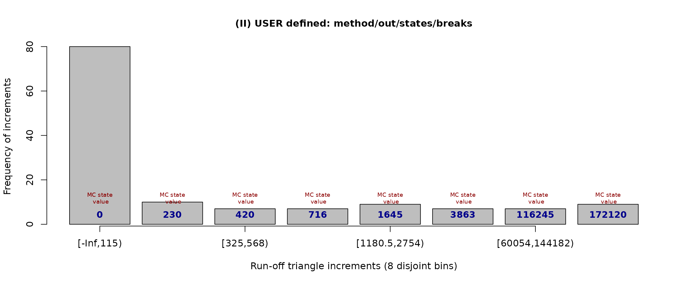

The same set of Markov states can be analogously used to run the MACRAME
prediction (the output is omitted for brevity):

``` r
mcReserve(casco, states = c(0, 230, 420, 716, 1645, 3863, 116245, 172120))
```

All negative and small (i.e., below $115$) increments are now
represented by one Markov state (zero) and other incremental payments
are represented by the remaining seven pre-specified states. The MACRAME
prediction with the same set of states can be performed by the
[`mcReserve()`](https://42463863.github.io/ProfileLadder/reference/mcReserve.md)
function by using the dedicated accesor method
[`mcStates()`](https://42463863.github.io/ProfileLadder/reference/mcStates.md)
as follows (alternatively, the sequence of the states can be also
plugged in explicitly):

``` r
mcReserve(casco, states = mcStates(modification.1))
```

The run-off triangle incremental payments are no longer equally
distributed among the bins—this can be only achieved if the break points
are calculated in the proposed data-driven manner.

However, the `states` parameter can be also specified differently.
Instead of specifying the underlying set of the Markov states it can be
used to change the amount of the states. For instance, the choice
`states = 5` will result in five Markov states and, again, the
increments will be distributed equally (as much as possible). This can
be also verified visually by

``` r
plot(incrExplor(casco, states = 5))
```

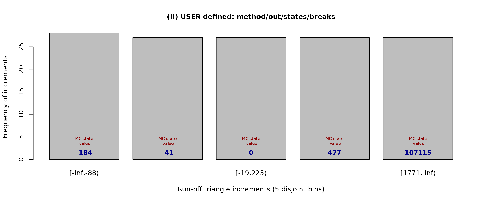

The same Markov states (rounded in the figure above) will be used by the
MACRAME algorithm when specifying the same amount of the Markov states,
i.e., `state = 5`. This can be directly veryfied by the following:

``` r
macrame.s5.casco <- mcReserve(casco, states = 5)
mcStates(macrame.s5.casco)
```

    ## [1]   -184.5    -41.0      0.0    477.0 107115.0

The corresponding break points are

``` r
mcBreaks(macrame.s5.casco)
```

    ## [1] -Inf  -88  -19  225 1771  Inf

and the transition matrix with the estimated transition probabilities is

``` r
mcTrans(macrame.s5.casco)
```

    ##        [,1]   [,2]   [,3]   [,4]   [,5]
    ## [1,] 0.2801 0.1960 0.3839 0.1400 0.0000
    ## [2,] 0.1644 0.2959 0.4740 0.0658 0.0000
    ## [3,] 0.0000 0.0000 1.0000 0.0000 0.0000
    ## [4,] 0.2206 0.1575 0.3383 0.1890 0.0945
    ## [5,] 0.1315 0.0000 0.2767 0.3288 0.2630

#### b) Specifying explict break points

Another parameter implemented for user modifications of the Markov chain
in the MACRAME algorithm is the parameter `breaks` which can be used to
explicitly provide the set of break points for the run-off triangle
increments.

However, a valid sequence of the break points—in a sense that
$g_{1} < g_{2} < \ldots < g_{m - 1}$—must be provided. The first and the
last break point ($g_{0} = - \infty$ and $g_{m} = \infty$) may or may
not be specified. On the other hand, two consecutive break points always
need to contain at least one incremental payment in between—otherwise,
such consecutive bins are merged together to form a new one.

Going back to the Casco incurance data where many negative increments
were noticed, it can be more appropriate to alter the underlying Markov
chain by providing a different set of break points (rather than changing
directly the Markov states). In such a way, the corresponding Markov
states will be still obtained using a statistical summary method (by
default, the Markov states are medians of the increments within the
bins).

The default break points are determined in a way that the increments are
equaly distributed among 17 non-overlapping bins (where the number of
bins being used is, by default, same as the dimension of the run-off
triangle). For instance, five bins with explicit breaks points
$\{ g_{m}\}_{m = 0}^{5} \equiv \{ - \infty,0,100,500,5000,\infty\}$ can
be obtained by

``` r
plot(modification.2 <- incrExplor(casco, breaks = c(0, 100, 500, 5000)))
```

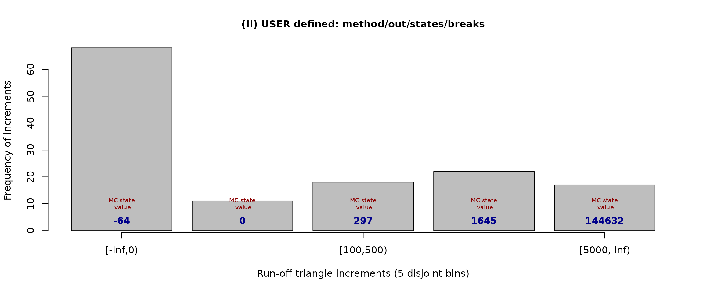

and the same resuld will be also obtained for any of the following
(outputs are omitted):

``` r
incrExplor(casco, breaks = c(-Inf, 0, 100, 500, 5000))
incrExplor(casco, breaks = c(0, 100, 500, 5000, Inf))
incrExplor(casco, breaks = c(-Inf, 0, 100, 500, 5000, Inf))
```

The corresponding Markov states are calculated (by default) as medians
of the increments within each bin and they can be assessed by using the
[`mcStates()`](https://42463863.github.io/ProfileLadder/reference/mcStates.md)
function

``` r
mcStates(modification.2)
```

    ## [1]    -63.5      0.0    297.0   1645.0 144632.0

The corresponding MACRAME reserve prediction using the same break points
(and the corresponding Markov states as well) is obtained analogously by

``` r
summary(mcReserve(casco, breaks = c(0, 100, 500, 5000)))
```

    ## MACRAME reserve prediction (by origins)
    ##          First   Latest Dev.To.Date   Ultimate       IBNR
    ## 2       423582   522003   0.9999172   522046.2    43.2500
    ## 3       373866   485984   1.0000000   485984.0     0.0000
    ## 4       441769   557049   0.9996132   557264.5   215.5362
    ## 5       503292   630271   1.0000000   630271.0     0.0000
    ## 6       554625   701433   1.0000000   701433.0     0.0000
    ## 7       613011   758233   0.9993793   758703.9   470.9047
    ## 8       605922   761068   0.9992867   761611.3   543.2598
    ## 9       555154   670158   0.9988864   670905.1   747.1026
    ## 10      514900   626112   0.9965579   628274.6  2162.6048
    ## 11      581196   708428   0.9988083   709273.2   845.2127
    ## 12      613266   781561   0.9990129   782333.3   772.2756
    ## 13      706120   894514   0.9973982   896847.4  2333.3986
    ## 14      859707  1059593   0.9977591  1061972.8  2379.7958
    ## 15      951189  1207771   0.9891633  1221002.6 13231.6383
    ## 16     1061511  1317965   0.9900306  1331236.6 13271.6275
    ## 17     1121591  1121591   0.9882740  1134898.8 13307.8470
    ## total 10480701 12803734   0.9960849 12854058.5 50324.4536

    ## Overall reserve summary

    ##     Est.Reserve    Est.Ultimate     Paid Amount    True Reserve        Reserve% 
    ##        50324.45     13543555.45     13493231.00              NA              NA

#### c) Summary method for incremental payments

Instead of summarizing the increments within each bin by considering the
median value, another method can be specified by another parameter
`method` which can take on of four values: `"median"` (default);
`"mean"`, `"min"`, and `"max"`.

Thus, considering the same set of breaks as before, it can be of some
interest to define Markov states not as medians of the increments within
each bin but taking maximum in every bin instead. This can be easily
achieved by

``` r
new.breaks <- c(0, 100, 500, 5000)
exploratory.casco2 <- incrExplor(casco, breaks = new.breaks, method = "max")
plot(exploratory.casco2)
```

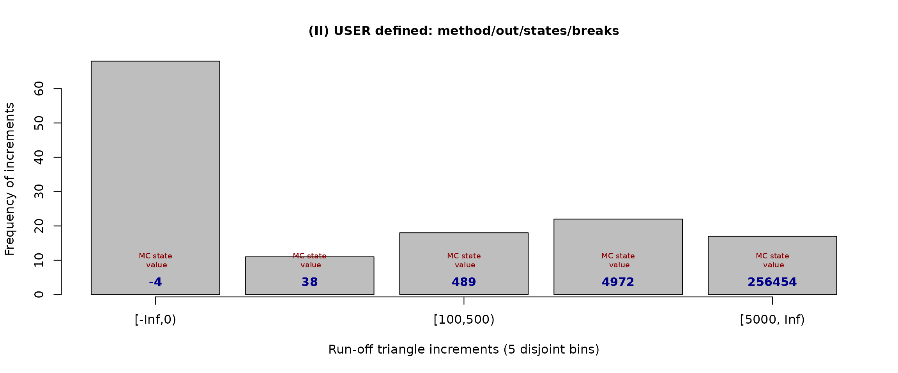

The parameter `method` is only available for the exploratory function
[`incrExplor()`](https://42463863.github.io/ProfileLadder/reference/incrExplor.md)
and, unlike the parameters `states` and `breaks`, it is not implemented
in the
[`mcReserve()`](https://42463863.github.io/ProfileLadder/reference/mcReserve.md)
function. This is, however, not limiting with respect to the performance
of the MACRAME algorithm implemented within
[`mcReserve()`](https://42463863.github.io/ProfileLadder/reference/mcReserve.md).
Indeed, the parameter `method = c("median", "mean", "min", "max")` is
used to summarize the increments within each bin defined by the break
points in `breaks = ...` and the corresponding Markov states can be
assessed from the
[`incrExplor()`](https://42463863.github.io/ProfileLadder/reference/incrExplor.md)
function by using the appropriate accessor method, the function
[`mcStates()`](https://42463863.github.io/ProfileLadder/reference/mcStates.md).
Consequently, both the breaks (provided explicitly) and the states
(obtained as maximal increments within each bin) can be forwarded into
the
[`mcReserve()`](https://42463863.github.io/ProfileLadder/reference/mcReserve.md)
function to set up the MACRAME algorithm correspondingly (output is
omitted again):

``` r
mcReserve(casco, breaks = mew.breaks, states = mcStates(exploratory.casco2))
```

The previous also implies that users can fully manually set the breaks
and the Markov states when running the MACRAME algorithm. A valid set of
breaks is needed and the states must be always provided in a way, that
exactly one Markov state belongs to one interval determined by two
consecutive break points. More details can be found the package
documentation—particularly in the following two help sessions

``` r
help("incrExplor")
help("mcReserve")
```

**Note:** There are four parameters implemented in the
[`incrExplor()`](https://42463863.github.io/ProfileLadder/reference/incrExplor.md)
function to help users to properly tune the underlying Markov chain for
the MACRAME prediction (`breaks = ...`, `states = ...`, `method = ...`,
and `out = ...`). On the other hand, there are only two parameters used
within the
[`mcReserve()`](https://42463863.github.io/ProfileLadder/reference/mcReserve.md)
function.

The summary method for run-off triangle increments can be enforced
within the
[`mcReserve()`](https://42463863.github.io/ProfileLadder/reference/mcReserve.md)
function by using the appropriate accessor functions:

- [`mcBreaks()`](https://42463863.github.io/ProfileLadder/reference/mcBreaks.md)
  – function for extracting the set of break points from
  [`incrExplor()`](https://42463863.github.io/ProfileLadder/reference/incrExplor.md)
  or
  [`mcReserve()`](https://42463863.github.io/ProfileLadder/reference/mcReserve.md);
- [`mcStates()`](https://42463863.github.io/ProfileLadder/reference/mcStates.md)
  – function for extracting the Markov states from
  [`incrExplor()`](https://42463863.github.io/ProfileLadder/reference/incrExplor.md)
  or
  [`mcReserve()`](https://42463863.github.io/ProfileLadder/reference/mcReserve.md);
- [`mcTrans()`](https://42463863.github.io/ProfileLadder/reference/mcTrans.md)
  – function to extract the estimated transition matrix from
  [`mcReserve()`](https://42463863.github.io/ProfileLadder/reference/mcReserve.md).

Note that the
[`mcTrans()`](https://42463863.github.io/ProfileLadder/reference/mcTrans.md)
function can be only applied to the output of the
[`mcReserve()`](https://42463863.github.io/ProfileLadder/reference/mcReserve.md)
function as there is not transition probability estimation in the
exploratory tool
[`incrExplor()`](https://42463863.github.io/ProfileLadder/reference/incrExplor.md).

The parameter `out = ...` implemented in the
[`incrExplor()`](https://42463863.github.io/ProfileLadder/reference/incrExplor.md)
function is discussed in the next section.

#### d) Subsets of incremental payments

The default functionality of the
[`incrExplor()`](https://42463863.github.io/ProfileLadder/reference/incrExplor.md)
function is to provide users with the data-driven set of bins (the break
points respectively) and the corresponding Markov states for the
underlying run-off triangle. The first year payments in the run-off
triagnle are not considered by default (further discussion is provided
in Maciak, Mizera, and Pešta, 2022), but this restriction can be also
altered—if needed.

If there is a specific interest to also include the first year payments
when defining the Markov chain states and the corresponding break points
(or, alternatively, to exclude some other columns with the incremental
payments), an additional parameter `out = 1` (default) can be changed
correspondingly—the default value stands for the first year increments
that are typically not considered; the choice `out = 0` uses all
available increments $X_{i,j}$, for $i = 1,\ldots,n$ and
$j = 1,\ldots,n + 1 - i$; in order to exclude, for example, first three
columns, the parameter can be specified as `out = c(1,2,3)`. The change
of this parameter is also reflected by the output of
[`incrExplor()`](https://42463863.github.io/ProfileLadder/reference/incrExplor.md)
which, in addition, contains analogous information as before, however,
for a user-modified subset of the incremental payments.

``` r
incrExplor(cameron, out = 0)
```

    ## Data-driven (default) setting of the Markov Chain in MACRAME

    ## MC States: 13 81 197 302.5 438 601 948 1672.5 3073 3993
    ## 
    ## Corresponding bins for the run-off triangle increments
    ##  [1] "[-Inf, 75)"   "[75, 147)"    "[147, 288)"   "[288, 388)"   "[388, 554)"  
    ##  [6] "[554, 780)"   "[780, 1465)"  "[1465, 2587)" "[2587, 3955)" "[3955, Inf)"

    ## User-modified MC setting

    ## MC States: 14.5 125 285.5 400 601 978 2186.5 3689 5007.5 5984
    ## 
    ## Corresponding bins for the run-off triangle increments
    ##  [1] "[-Inf, 79)"   "[79, 197)"    "[197, 349)"   "[349, 529)"   "[529, 786)"  
    ##  [6] "[786, 1595)"  "[1595, 3085)" "[3085, 3984)" "[3984, 5244)" "[5244, Inf)" 
    ## 
    ## Development periods (run-off triangle columns) not considered: 0
    ## Method selected to summarize the increments within each bin: DEFAULT (median)

The S3 method [`plot()`](https://rdrr.io/r/graphics/plot.default.html)
can be applied to obtain some graphical visualization of the
user-defined subset of increments and their overall summary (together
with the comparison with the default selection).

``` r
par(mfrow = c(1,2))
plot(incrExplor(cameron, out = 0))
```

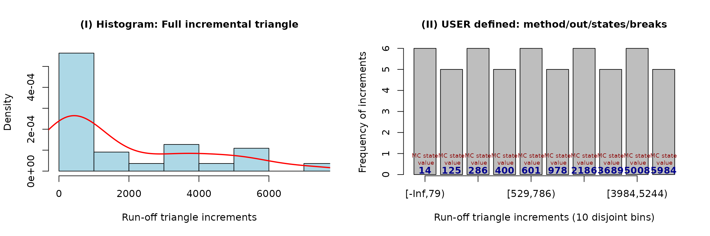

#### e) Illustration of different MACRAME settings

Different settings for the break points and the Markov states result in
different reserve predictions (and the corresponding missing profiles
completions). In the following, there is again the Cameron Mutual
dataset used (with the known true reserve 7963) with the predicted
reserves ranging from 7827 (slightly underestimated reserve) up to 22587
(heavily overestimated reserve).

Various user-based modifications are used for the MACRAME predictions
below (the first one being the default performance).

``` r
par(mfrow = c(3,2))

plot(mcReserve(cameron)) ### default setting with 10 MC states
plot(mcReserve(cameron, states = 4)) ### four states (otherwise default)
plot(mcReserve(cameron, states = c(50, 500, 1500, 3000))) ### explicit states
plot(mcReserve(cameron, breaks = c(500, 1000, 1500, 2000))) ### explicit breaks
     
user.breaks <- c(500, 1000, 1500, 2000)
user.method <- incrExplor(cameron, breaks = user.breaks, method = "max")
final.states <- mcStates(user.method)
### explicit breaks and Markov states as maximma 
plot(mcReserve(cameron, breaks = user.breaks, states = final.states))

### explicit breaks and explicit states
plot(mcReserve(cameron, breaks = c(500, 1000, 1500), states = c(100, 999, 1001, 3000))) 
```

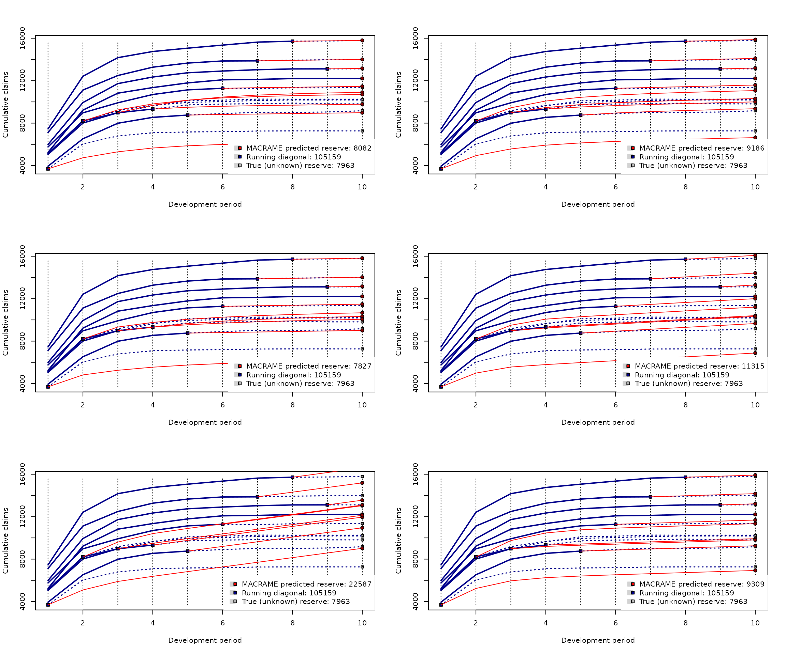

**Note:** The default performance of the MACRAME algorithm implemented
by the **R** function
[`mcReserve()`](https://42463863.github.io/ProfileLadder/reference/mcReserve.md)
is fully-data driven and it fully corresponds with the breaks and Markov
states as proposed and theoretically justified in Maciak, Mizera, and
Pešta, (2022).

## 5. Permutation bootstrap

The reserve prediction $\widehat{R}$ for the unknown claims reserve $R$
provides only a partial information in the entire loss reserving
problem. In practice, a prediction of the whole reserve distribution is
required too (for instance, by risk reserving assessment guidelines like
Solvency II).

Classical techniques employ a residual (parametric or semiparametric)
bootstrap approach (typically based on the back-fitted residuals) to
emulate the distribution of interest. However, for the functional-based
claims reserving there is a different strategy: permutation bootstrap.
The prediction of the reserve distribution is still obtained via
bootstrap resampling, but the algorithm avoids the use of residuals by
resampling (permuting) the whole functional profiles. The rows of the
completed run-off triangle produced by a certain algorithm—by each of
those described above, but also any of the classical parametric
reserving models implemented in the `ChainLadder` package—are treated as
independent functional profiles. The completed triangle, the data matrix
$\{{\widehat{Y}}_{i,j}\}_{i,j = 1}^{n,n}$, can be standardized: each row
is divided by the first positive value within the row (considered from
the left—which is, very likely, the first incremental payment in each
row). The standardization step is proposed on the grounds that it is
very typical in practice that the claims amounts paid in the first
development period substantially increase over the years (possibly the
effect of economical growth, inflation, more advanced or more expensive
technology, etc.). The standardization is set as a default, but the user
can suppress it if desiring so.

``` r
permute.cameron <- permuteReserve(mcReserve(cameron), B = 100)
```

The output from the
[`permuteReserve()`](https://42463863.github.io/ProfileLadder/reference/permuteReserve.md)
function is an object of the S3 class `permutedReserve` and S3 methods
[`summary()`](https://rdrr.io/r/base/summary.html) or
[`plot()`](https://rdrr.io/r/graphics/plot.default.html) can be applied
to get more detailed information:

``` r
summary(permute.cameron)
```

    ## MACRAME based reserve prediction (with B = 100 bootstrap permutations)
    ##       First Latest Dev.To.Date   Ultimate       IBNR        S.E        CV
    ## 2      5984  13113   0.9964286  13160.000   47.00000   20.35946 0.4331799
    ## 3      7452  15720   0.9950067  15798.889   78.88889   38.10804 0.4830597
    ## 4      7115  13872   0.9906724  14002.611  130.61111  116.55286 0.8923656
    ## 5      5753  11282   0.9840866  11464.438  182.43827  158.73832 0.8700933
    ## 6      3937   8757   0.9749940   8981.594  224.59362  125.88048 0.5604811
    ## 7      5127   9325   0.9535135   9779.620  454.61986  253.74400 0.5581455
    ## 8      5046   8984   0.8241040  10901.537 1917.53724  552.09226 0.2879174
    ## 9      5129   8202   0.7664369  10701.468 2499.46806  644.56539 0.2578810
    ## 10     3689   3689   0.5915835   6235.806 2546.80632  523.25414 0.2054550
    ## total 49232  92944   0.9200011 101025.963 8081.96337 1348.35146 0.1668346

    ## Overall reserve distribution

    ##      Boot.Mean        Std.Er.       BootCov%    BootVar.995 
    ##    9526.563369    1348.351459      14.153598       1.436145 
    ## 
    ## The MACRAME predicted reserve represents the 10.89% quantile of the reserve distribution
    ## Bootstrap simulated reserves beyond 2σ rule: 5 (out of 100)

``` r
plot(permute.cameron)
```

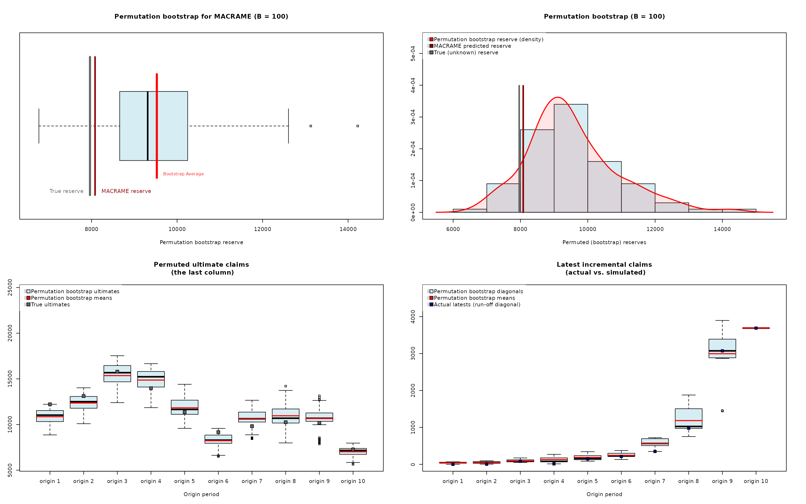

Note that in the summary output above there already colums `S.E.` and
`CV` provided and they can be directly compared with the values obtained
from the distributional assumption (using, for instance, the
over-dispersed Poisson model) from the `ChainLadder` package

``` r
summary(glmReserve(observed(cameron)))
```

    ##       Latest Dev.To.Date Ultimate IBNR          S.E        CV
    ## 2      13113   1.0000000    13113    0   0.01035287       Inf
    ## 3      15720   0.9992372    15732   12  29.38975320 2.4491461
    ## 4      13872   0.9934116    13964   92  73.46098788 0.7984890
    ## 5      11282   0.9850694    11453  171  96.26787355 0.5629700
    ## 6       8757   0.9688019     9039  282 120.58781735 0.4276164
    ## 7       9325   0.9397360     9923  598 177.57019068 0.2969401
    ## 8       8984   0.8905630    10088 1104 246.00693847 0.2228324
    ## 9       8202   0.7789914    10529 2327 379.54811405 0.1631062
    ## 10      3689   0.4788422     7704 4015 622.22022041 0.1549739
    ## total  92944   0.9152986   101545 8601 880.66723938 0.1023913

**Note:** The permutation bootstrap implemented in the **R** function
[`permuteReserve()`](https://42463863.github.io/ProfileLadder/reference/permuteReserve.md)
(from the **R** package `ProfileLadder`) handles not only objects
created by the
[`parallelReserve()`](https://42463863.github.io/ProfileLadder/reference/parallelReserve.md)
function and the
[`mcReserve()`](https://42463863.github.io/ProfileLadder/reference/mcReserve.md)
function (thus, S3 objects of the class `profileLadder`) but it also
works with the objects generated by the classical reserving
techniques—those implemented in the **R** package `ChainLadder` (in
particular, the over-dispersed Poisson model, the Mack model,
chainladder model, or the Tweedie formula).

Note also the same layout used for the S3 method
[`plot()`](https://rdrr.io/r/graphics/plot.default.html) when applied to
the output of the permutation bootstrap function `pemuteReserve()` as
the one adoped for the residual bootstrap resampling in classical
parametric chainladder based methods:

``` r
plot(BootChainLadder(observed(cameron)))
```

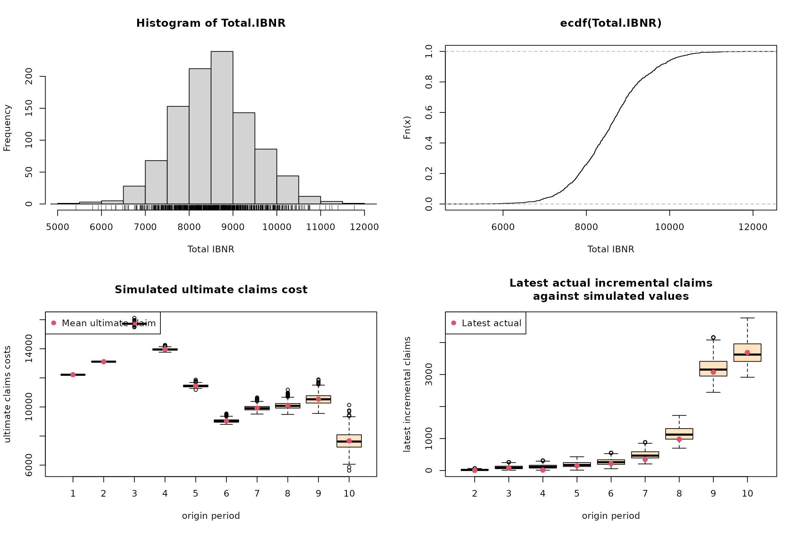

Thus, the overall distributional (reserve) prediction can be obtained
from different perspective: adopting some distributional assumptions
(such as the Poisson model), using the residual bootstrap approach, or
performing the permutation bootstrap for whole functional profiles.

``` r
cameron.glm <- glmReserve(observed(cameron))
cameron.boot <- glmReserve(observed(cameron), mse.method = "bootstrap", nsim = 100)
cameron.permute <- permuteReserve(glmReserve(observed(cameron)), B = 100)
```

All three [`summary()`](https://rdrr.io/r/base/summary.html) outputs
below contains full information (especially the last two columns denoted
as `S.E` and `CV`):

``` r
summary(cameron.glm)
```

    ##       Latest Dev.To.Date Ultimate IBNR          S.E        CV
    ## 2      13113   1.0000000    13113    0   0.01035287       Inf
    ## 3      15720   0.9992372    15732   12  29.38975320 2.4491461
    ## 4      13872   0.9934116    13964   92  73.46098788 0.7984890
    ## 5      11282   0.9850694    11453  171  96.26787355 0.5629700
    ## 6       8757   0.9688019     9039  282 120.58781735 0.4276164
    ## 7       9325   0.9397360     9923  598 177.57019068 0.2969401
    ## 8       8984   0.8905630    10088 1104 246.00693847 0.2228324
    ## 9       8202   0.7789914    10529 2327 379.54811405 0.1631062
    ## 10      3689   0.4788422     7704 4015 622.22022041 0.1549739
    ## total  92944   0.9152986   101545 8601 880.66723938 0.1023913

``` r
summary(cameron.boot)
```

    ##       Latest Dev.To.Date Ultimate IBNR       S.E         CV
    ## 2      13113   1.0000000    13113    0   0.00000        NaN
    ## 3      15720   0.9992372    15732   12  39.78803 3.31566877
    ## 4      13872   0.9934116    13964   92  69.63145 0.75686361
    ## 5      11282   0.9850694    11453  171  88.73998 0.51894727
    ## 6       8757   0.9688019     9039  282 108.17280 0.38359149
    ## 7       9325   0.9397360     9923  598 174.12157 0.29117319
    ## 8       8984   0.8905630    10088 1104 267.14475 0.24197894
    ## 9       8202   0.7789914    10529 2327 393.02842 0.16889919
    ## 10      3689   0.4788422     7704 4015 556.93632 0.13871390
    ## total  92944   0.9152986   101545 8601 841.41341 0.09782739

``` r
summary(cameron.permute)
```

    ## GLM based reserve prediction (with B = 100 bootstrap permutations)
    ##       First Latest Dev.To.Date Ultimate IBNR         S.E        CV
    ## 2      5984  13113   1.0000000    13113    0    0.000000       NaN
    ## 3      7452  15720   0.9992372    15732   12    3.087699 0.2573083
    ## 4      7115  13872   0.9934116    13964   92   14.070626 0.1529416
    ## 5      5753  11282   0.9850694    11453  171   35.269466 0.2062542
    ## 6      3937   8757   0.9688019     9039  282   89.645139 0.3178906
    ## 7      5127   9325   0.9397360     9923  598  140.511467 0.2349690
    ## 8      5046   8984   0.8905630    10088 1104  220.787040 0.1999883
    ## 9      5129   8202   0.7789174    10530 2328  544.173060 0.2337513
    ## 10     3689   3689   0.4789043     7703 4014 1225.273638 0.3052500
    ## total 49232  92944   0.9152986   101545 8601 1231.636024 0.1431968

    ## Overall reserve distribution

    ##      Boot.Mean        Std.Er.       BootCov%    BootVar.995 
    ##   10916.062751    1231.636024      11.282786       1.232687 
    ## 
    ## The GLM predicted reserve represents the 4.95% quantile of the reserve distribution
    ## Bootstrap simulated reserves beyond 2σ rule: 1 (out of 100)

**Note:** The
[`permuteReserve()`](https://42463863.github.io/ProfileLadder/reference/permuteReserve.md)
function returns a relatively complex **R** object of the S3 class
`permutedReserve` which can be quite memory demanding (especially for
large run-off triangles and large number of permutations. For this
reason, there is an additional parameter `outputAll = TRUE` (set as
`TRUE` by default) used to suppress compex outputs and important summary
characteristics are printed only (for `outputAll = FALSE`).

## 6. Generic S3 method `predict()`

Finally, there is one key S3 method implemented in the **R** package
`ProfileLadder` that was not mentioned yet—the S3 method
[`predict()`](https://rdrr.io/r/stats/predict.html). This function is
not only useful for the actuaries, but it also has important practical
utilizations in any type of risk modeling. The S3 method
[`predict()`](https://rdrr.io/r/stats/predict.html) is implemented for
the objects of the S3 class `profileLadder` that are created by the
[`parallelReserve()`](https://42463863.github.io/ProfileLadder/reference/parallelReserve.md)
function or the
[`mcReserve()`](https://42463863.github.io/ProfileLadder/reference/mcReserve.md)
function (for details, we refer to the help session obtained by
[`help("predict.profileLadder")`](https://42463863.github.io/ProfileLadder/reference/predict.profileLadder.md).

Instead of completing the run-off triangle into a full square (as
performed by one of the algorithms PARALLAX, REACT, or MACRAME), the
[`predict()`](https://rdrr.io/r/stats/predict.html) method only returns
the prediction of the next running diagonal (also called a *1-step-ahead
prediction* in the acturial circles).

The same nonparametric algorithms are used for the diagonal prediction;
however, the output is not a completed square but rather a new
(extended) run-off triangle of the dimensions $n \times (n + 1)$:

``` r
(diag.cameron <- predict(parallelReserve(cameron)))
```

    ## 5244      9228   10823   11352   11791   12082   12120   12199   12215   12215   12215   
    ## 5984      9939   11725   12346   12746   12909   13034   13109   13113   13113       .   
    ## 7452     12421   14171   14752   15066   15354   15637   15720   15724       .       .   
    ## 7115     11117   12488   13274   13662   13859   13872   13947       .       .       .   
    ## 5753      8969    9917   10697   11135   11282   11320       .       .       .       .   
    ## 3937      6524    7989    8543    8757    8904       .       .       .       .       .   
    ## 5127      8212    8976    9325    9539       .       .       .       .       .       .   
    ## 5046      8006    8984    9333       .       .       .       .       .       .       .   
    ## 5129      8202    8966       .       .       .       .       .       .       .       .   
    ## 3689      6276       .       .       .       .       .       .       .       .       .   

The S3 method [`plot()`](https://rdrr.io/r/graphics/plot.default.html)
can be used to visualize the diagonal *1-step-ahead* prediction

``` r
plot(diag.cameron)
```

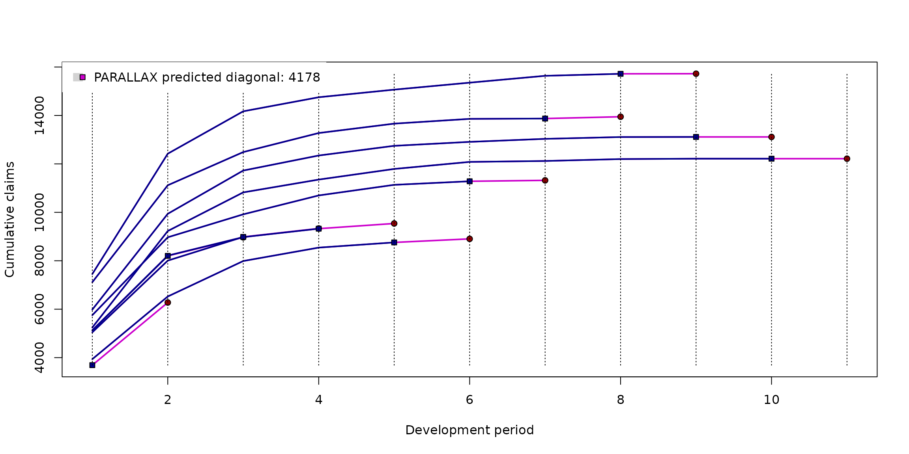

## Conclussion

The main core of the **R** package `ProfileLadder` consists of three key
functions—[`parallelReserve()`](https://42463863.github.io/ProfileLadder/reference/parallelReserve.md)
for applying the PARALLAX or REACT algorithm,
[`mcReserve()`](https://42463863.github.io/ProfileLadder/reference/mcReserve.md)
implementing the MACRAME algorithm, and `permutedReserve()` providing
the permutation bootstrap add-on. Another generic functions (for the S3
objects of the class `profileLadder`, `profilePredict`, `mcSetup`, and
`permutedReserve`) are also implemented to facilitate a well structured
summary of the outputs and graphical visualizations of the results.

There are also a few other helpful functions implemented in the
`ProfileLadder` package. For a complex description and illustrative
examples, we refer to the **R** help sessions by using the standard
[`help()`](https://rdrr.io/r/utils/help.html) command.

The `ProfileLadder` package is particularly developed to implement
nonparametric methods into the actuarial risk assessment process
performed by insurance companies (typically on a yearly or quarterly
basis). Nevertheless, the underlying run-off triangle can be formally
also represented in terms of an incomplete panel data scheme that is
generally well known among statisticians and all types of practitioners.

------------------------------------------------------------------------

#### Acknowledgement

The authors express sincere thanks to Kurt Hornik and Rob Hyndman for
their insight and some useful pieces of advice regarding the
`ProfileLadder` package. The authors are also grateful to Petr Jedlička
from the Czech Insurers’ Bureau and Pavel Koudelka from Generali Česká
pojišťovna a.s., for providing complex data from real-life insurance
practice—not only for internal evaluation purposes but also for public
access within the **R** package `ProfileLadder`.
